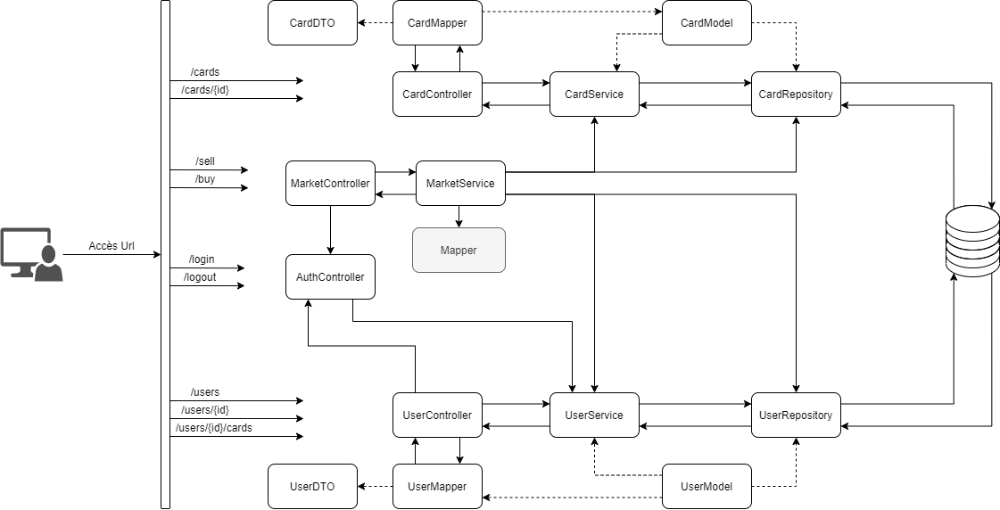

# Membre du Groupe

 - Dorian DUGUE
 - Enzo CONTINI
 - Hugo FERRER
 - Brian GASPARINI-BARRELON

link Github :
https://github.com/briangasparini/TP_ASI_FERRER_CONTINI_DUGUE_GASPARINI.git

# ATELIER 2

## Diagramme de notre Architecture

## Cahiers des charges

 - [ ] Plateforme d'achat et de vente de cartes
	 - [ ] Inscription utilisateurs
		 - [ ] Front : 
			 - [x] Formulaire 
			 - [ ] Appel API
		 - [ ] Back : 
			 - [x] Création d'utilisateur
			 - [ ] Réception de 5 cartes à l'inscription
	 - [ ] Connexion
		 - [ ] Front : 
			 - [x] Formulaire de connexion 
			 - [ ] Appel API
			 - [ ] Gestion réponse API
		 - [x] Back : 
			 - [x] Vérification BDD 
	 - [ ] Achats de cartes sur la plateforme
		 - [ ] Front
			 - [x] Esthétique de la page
			 - [ ] Appel API
		 - [x] Back
			 - [x] Ajouter la carte à l'utilisateur
			 - [x] Gestion du solde utilisateur + système
	 - [ ] Vente de cartes sur la plateforme
		 - [ ] Front
			 - [x] Esthétique de la page
			 - [ ] Appel API
		 - [x] Back
			 - [x] Supprimer la carte de l'utilisateur
			 - [x] Remettre en vente la carte => mettre système en owner
			 - [x] Mettre à jour le solde utilisateur + système

